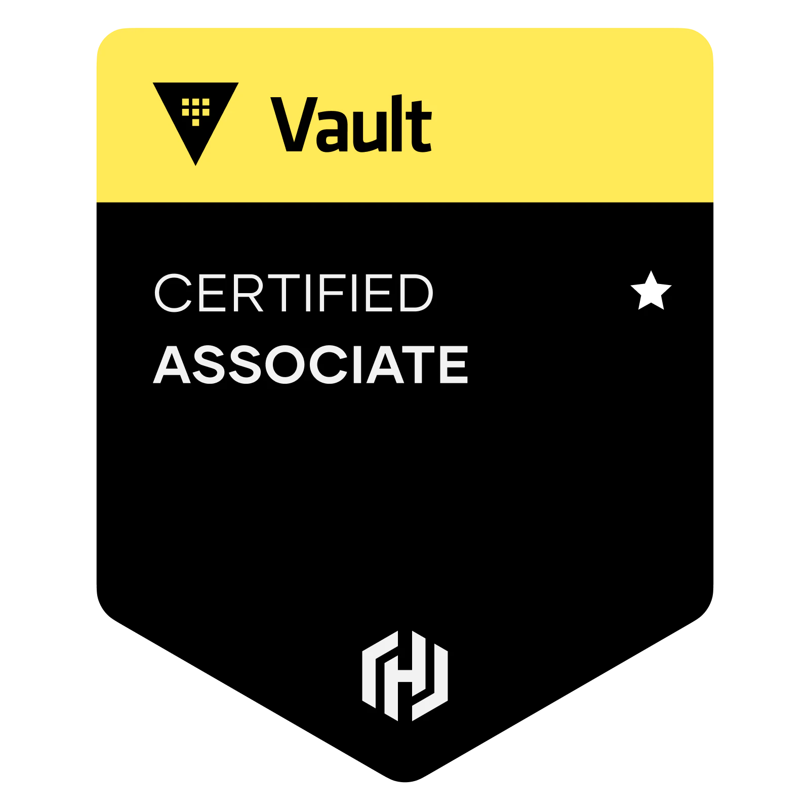

# HCVA HashiCorp Certified: Vault Associate (002) — Study Notes
HashiCorp Security Automation Certification

[Exam objectives](https://www.hashicorp.com/certification/vault-associate|)

[Study Guide](https://developer.hashicorp.com/vault/tutorials/associate-cert/associate-study?product_intent=vault)

[Review Guide](https://developer.hashicorp.com/vault/tutorials/associate-cert/associate-review)

[Practical Demos](https://terraformguru.com/terraform-certification-using-aws-cloud/)

  

 
  
---  

## Exam details

Exam Details  |   |
------------- | - |  
Assessment Type	| Multiple choice
Format	| Online proctored
Duration	| 1 hour
Price	| $70.50 USD plus locally applicable taxes and fees
Language	| English
Expiration |	2 years

---  

## Exam objectives

| Section | Exam Objective     |  Documentation   | Tutorial  |
| ------- | ------------------ |  --------------- | --------- | 
1	Compare authentication methods		
1a	Describe authentication methods	Authentication	Authentication
1b	Choose an authentication method based on use case	Authentication	AppRole Pull Authentication - Authentication
1c	Differentiate human vs. system auth methods	Authentication	AppRole Pull Authentication - Authentication
2	Create Vault policies		
2a	Illustrate the value of Vault policy	Policies	Vault Policies
2b	Describe Vault policy syntax: path	Policy Syntax	Vault Policies– Write ACL policies in HCL format
2c	Describe Vault policy syntax: capabilities	Capabilities	Vault Policies– Write ACL policies in HCL format
2d	Craft a Vault policy based on requirements		Vault Policies– Policy requirements
3	Assess Vault tokens		
3a	Describe Vault token	Tokens	Tokens
3b	Differentiate between service and batch tokens. 
Choose one based on use case	Tokens	Batch Tokens
3c	Describe root token uses and lifecycle	Root Tokens	Generate Root Tokens Using Unseal Keys
3d	Define token accessors	Token Accessors	
3e	Explain time-to-live	Token Accessors	Service Token Lifecycle
3f	Explain orphaned tokens	Token Hierarchies and Orphan Tokens	Tokens– Orphan tokens
3g	Create tokens based on need		Tokens
4	Manage Vault leases		
4a	Explain the purpose of a lease ID	Lease, Renew, and Revoke	Secrets as a Service: Dynamic Secrets
4b	Renew leases	Lease, Renew, and Revoke	Secrets as a Service: Dynamic Secrets
4c	Revoke leases	Lease, Renew, and Revoke	Secrets as a Service: Dynamic Secrets
5	Compare and configure Vault secrets engines		
5a	Choose a secret method based on use case	Secrets Engines	
5b	Contrast dynamic secrets vs. static secrets and their use cases	Use Case – Secrets Management	
5c	Define transit engine	Transit Secrets Engine	Encryption as a Service: Transit Secrets Engine
5d	Define secrets engines	Secrets Engines – Overview	
6	Utilize Vault CLI		
6a	Authenticate to Vault	Authentication	Authentication
6b	Configure authentication methods		Authentication
6c	Configure Vault policies		Policies Vault Policies
6d	Access Vault secrets		Secrets Engines Secrets Management Learning Track
6e	Enable Secret engines		Secrets Engines Secrets Management Learning Track
6f	Configure environment variables	Environment Variables	Configure Vault
7	Utilize Vault UI		
7a	Authenticate to Vault		Authentication
7b	Configure authentication methods		Authentication
7c	Configure Vault policies		Vault Policies
7d	Access Vault secrets		Manage Secrets Engine
7e	Enable Secret engines		Manage Secrets Engine
8	Be aware of the Vault API		
8a	Authenticate to Vault via Curl	API – Auth Methods	AppRole Pull Authentication
8b	Access Vault secrets via Curl	API – Secrets Engines	Using the HTTP APIs with Authentication
9	Explain Vault architecture		
9a	Describe the encryption of data stored by Vault	Introduction to Vault	
9b	Describe cluster strategy		Vault Reference Architecture
9c	Describe storage backends	storage stanza	Deploy Vault
9d	Describe the Vault agent	Vault Agent	Vault Agent with AWS
9e	Describe secrets caching	Vault Agent	Vault Agent Caching
9f	Be aware of identities and groups		Identity: Entities and Groups
9g	Describe Shamir secret sharing and unsealing		Deploy Vault – Seal/Unseal
9h	Be aware of replication	 Vault Enterprise Replication	[Enterprise] Setting up Performance Replication
9i	Describe seal/unseal		Deploy Vault – Seal/Unseal
9j	Explain response wrapping	Response Wrapping	Cubbyhole Response Wrapping
9k	Explain the value of short-lived, dynamically generated secrets		Secrets as a Service: Dynamic Secrets Dynamic Secrets
10	Explain encryption as a service		
10a	Configure transit secret engine		Encryption as a Service: Transit Secrets Engine
10b	Encrypt and decrypt secrets		Encryption as a Service: Transit Secrets Engine
10c	Rotate the encryption key		Encryption as a Service: Transit Secrets Engine

---  
